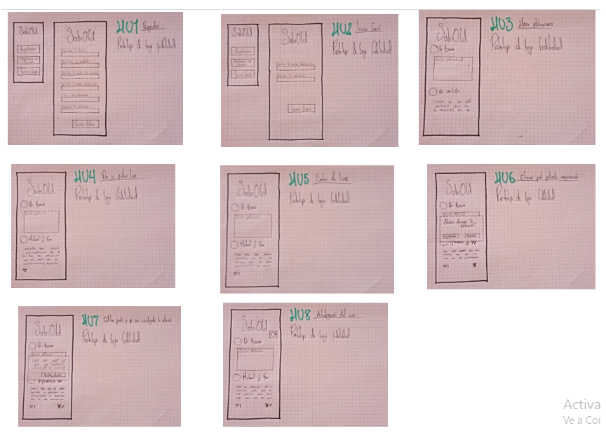
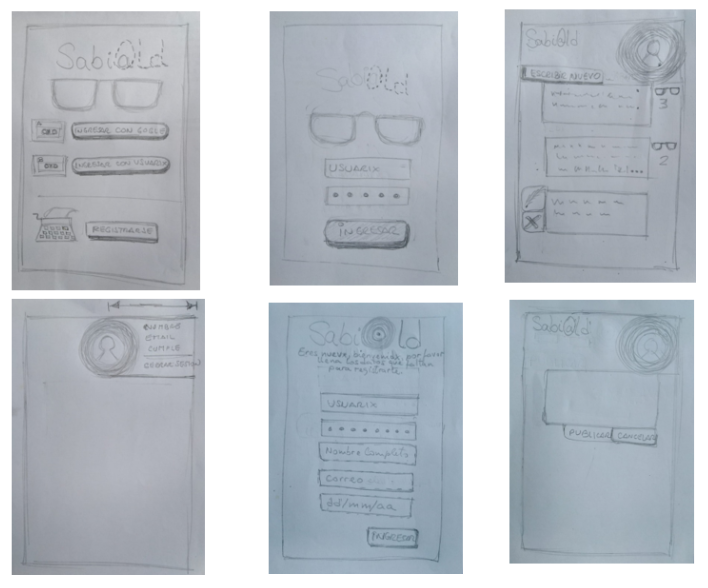
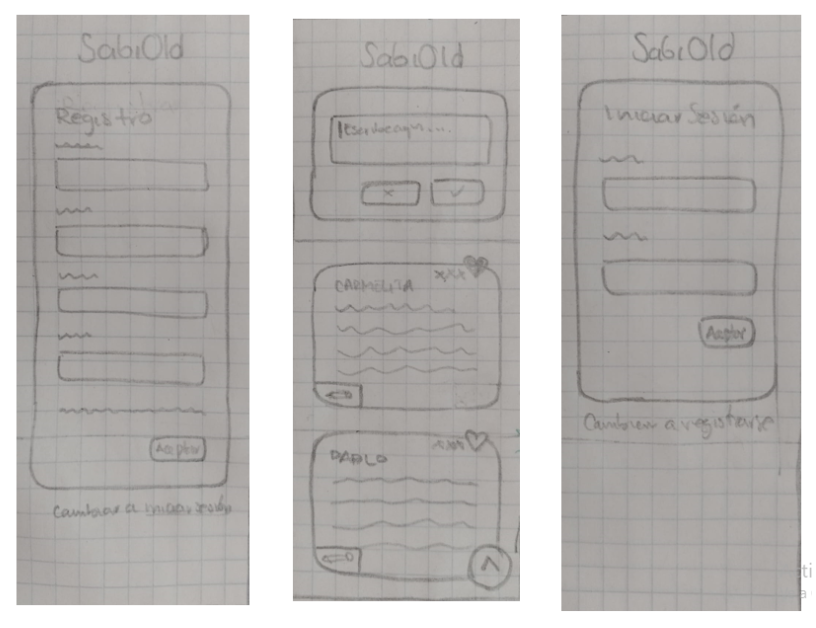
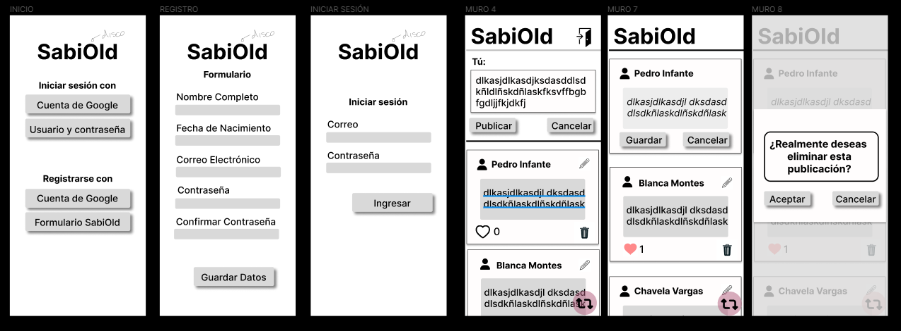
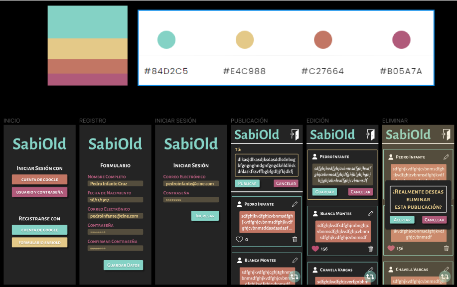
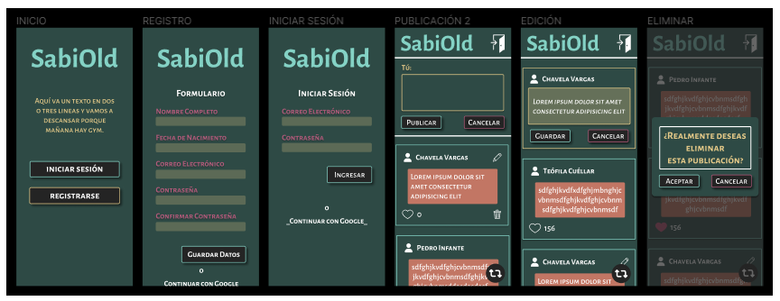

# Creando una Red Social

## Índice

* [1. Definición de Producto](#1-definicion-de-producto)
* [2. Historias de Usuario](#2-historias-de-usuario)
* [3. Prototipo de Baja Fidelidad](#3-prototipo-de-baja-fidelidad)
* [4. Prototipo de Alta Fidelidad](#4-prototipo-de-alta-fidelidad)
* [5. Link a Netlify](#5-link-a-netlify)

# 1. Definición de Producto

SabiOld, es una SPA diseñada para conectar a los adultos mayores, estas personas que han sido relegadas y dejadas de lado en el mundo actual debido a las redes sociales que están destinas a jóvenes y adultos. 

La finalidad de esta aplicación es lograr que cada adulto mayor pueda compartir experiencias, vivencias y pensamientos con sus contemporaneos. Los colores, botones y tamaños de fuente están diseñados justamente para sean comprendidos por nuestros usuarios.

# 2. Historias de Usuario

## HU1: Registrarse

**Yo como:** Adulto mayor nuevo en tecnología y sin una cuenta en SabiOld(nombre)
**Quiero:** poder registrarme en la RS SabiOld  (nombre) de manera fácil y rápida
**Para:** no estancarme en este proceso inicial y desanimarme de continuar.

**CRITERIOS DE ACEPTACIÓN:**

- El usuario debe poder encontrar una página inicial en donde haya un botón de registro bien sea con un correo electrónico de Google o con un correo de un dominio diferente.

- El usuario debe poder visualizar los campos a diligenciar y que estos sean claros

- El usuario debe poder dar click en el botón que haga el registro para que lo rellene adecuadamente

- Que el usuario pueda leer claramente

- Acceder llenando un formulario o a través de los datos de google.

**DEFINICIÓN DE TERMINADO:**

**- Crear una pantalla inicial en donde se ubiquen las opciones mediante botones de:**

- Registro con correo de Google.

- Registro con una cuenta de correo y contraseña.

- En el caso de realizar el registro con la opción de cuenta de Google debe automáticamente ser dirigido al inicio del muro.

**- En el caso de realizar el registro con la opción de cuenta de correo diferente debe poder encontrar los input necesarios para la creación de la cuenta** 

- Nombres, Apellidos

- Correo electrónico

- Contraseña

- Confirmar contraseña

**- En el caso de realizar el registro con google recopilar** 

- Nombres, Apellidos, Correo electrónico

- Incorporar la aparición de notas en caso de que algún campo no sea diligenciado correctamente.

- Ubicar un button que permita el guardado en la base de datos

- Verificar que se generó el registro en la base de datos con correo y contraseña

- Verificar que se generó el registro en la base de datos con acceso google

## HU2: Iniciar Sesión

**Yo como:** Adulto mayor con intención de ver lo que han compartido mis contemporáneos
**Quiero:** iniciar sesión en la red social
**Para:** ver que han compartido otrxs usuarixs

**CRITERIOS DE ACEPTACIÓN:**

- En la pantalla inicial donde se encuentra ubicadas las opciones registro debe estar incluido debe estar la opción de inicio de sesión

- Al clickear la opción de inicio de sesión muestra una pantalla con los datos a diligenciar para el inicio de sesión

- Debe poder encontrar un botón de iniciar sesión

- Que el diseño está adaptado a las necesidades visuales (tamaño de letra, colores, fuentes, espacios) del usuarix

- Datos básicos (correo, contraseña)

- Acceder a través de google.

- Error de validación, o de contraseña incorrecta, adaptada a las necesidades visuales del usuarix 

- Botón de acceso 

**DEFINICIÓN DE TERMINADO:**

- Mostrar validación de datos (válido/inválido)
- Verificar que se puede acceder
- En la pantalla inicial donde se encuentra ubicado el registro se debe incluir un button de inicio de sesión que lleve a determinada pantalla
- Se debe incorporar un input para diligenciar el correo electrónico
- Se debe incorporar un input para diligenciar la contraseña del usuario (Tener en cuenta que este campo al ser diligenciado debe verse en pantalla de manera oculta y que debe incluir 6 carácteres alfabéticos o numéricos)
- Ubicar el button que debe ser clickeado para ingresar y que tenga la determinada funcionalidad
- Crear acceso para inicio de sesion con google

## HU3: Hacer Publicaciones

**Yo como:** Adulto mayor con problemas visuales y amante del pensamiento crítico
**Quiero:** Escribir textos y publicarlos sin esforzar la vista
**Para:**  No irritar los ojos antes de publicar y dejar mi escrito a medias

**CRITERIOS DE ACEPTACIÓN:** 

- Encontrar en la pantalla un cajón en donde pueda escribir pensamiento a publicar

- Debe ubicar un botón que al clickear publique el post en el muro

- Visualiza la longitud permitida de la publicación

- Mostrar un máximo de xx caracteres, y agregar “...más” si el texto es mayor. (me parecería que para lo que están pidiendo en el readme no sería necesario, sé que sería lindo pero pues no sé qué tanto pueda implicar a la hora implementarlo en código)

- Que las publicaciones se vayan sumando de lo más reciente a lo más antiguo  (me parecería que para lo que están pidiendo en el readme no sería necesario, sé que sería lindo pero pues no sé qué tanto pueda implicar a la hora implementarlo en código)

- Siempre que haga una publicación nueva el cajón de texto debe pasar a blanco o vacío

- Botón de descartar publicar post

**DEFINICIÓN DE TERMINADO:** 

- Ubicar un input que permita la escritura de 1300 carácteres válidos (no se acepta el espacio como único caracter) como máximo

- Deben haberse ubicado dos botones con su respectiva funcionalidad (1. Publicar) 

- Deben haberse ubicado dos botones con su respectiva funcionalidad (2. Descartar Publicación) 

- Que al publicar se limpie el input para escribir otro post

- Subir publicación a firebase con uid user

- Mostrar publicación

## HU4: Dar o Quitar like

**Yo como:** Adulto mayor interesado en la política 
**Quiero:** interactuar mediante likes con otras publicaciones
**Para:** demostrar si me gusta o no una publicación

**HU4.1**

**Yo como:** adulto mayor y lector continuo de los textos publicados en la RS SabiOld
**Quiero:** mostrar mi satisfacción por aquellos textos que más me gustaron 
**Para:** incentivar a quien compartió a que siga escribiendo.

**HU4.2**

**Yo como:** adulto mayor con problemas neurológicos (temblor en las manos) 
**Quiero:** deshacer un like que fue presionado por error
**Para:** no confundir los textos que realmente me gustan con los que no.

**CRITERIOS DE ACEPTACIÓN**

- Que sea visual el cambio (p.e. color diferente) de like y dislike Se debe poder clickear el like y que este sea visualizado mediante el cambio de color

- Al clickear nuevamente el like que fue dado este debe volver a su color inicial

**DEFINICIÓN DE TERMINADO**

- Incorporar un ícono que al ser clickeado cambie su color y al ser nuevamente clickeado retorne al color inicial

- Que se pueda interactuar correctamente con el botón de like

## HU5: Conteo de likes

**Yo como:** Adulta mayor interesada en conocer el agrado de mis publicaciones
**Quiero:** saber a cuántas personas les a gustado mi publicación  
**Para:** seguir publicando sobre lo mismo o temas similares para lxs usuarios de la RS

**CRITERIOS DE ACEPTACIÓN**

- Acumular un like por usuario en cada publicación

**DEFINICIÓN DE TERMINADO**

- Que se muestre el número de interacciones correcto

## HU6: Eliminar post pidiendo confirmación

**Yo como:** Adulto mayor que había publicado mi opinión sobre una noticia
**Quiero:** poder eliminar post de autoría propia previa confirmación
**Para:** borrar si me arrepiento de publicar

**HU6.1**

**Yo como:** adulta mayor acostumbrada a publicar textos intachables en SabiOld 
**Quiero:** eliminar una publicación hecha medio dormida
**Para:** mantener mis publicaciones en óptimo estado.

**HU6.2**

**Yo como:** adulta mayor nueva escribiendo en SabiOld
**Quiero:** que me pida confirmación antes de eliminar una publicación 
**Para:** no eliminar un texto por error

**CRITERIOS DE ACEPTACIÓN**

- Que haya un botón con opción de eliminar

- Al presionar el botón Eliminar nos muestre un cuadro de diálogo pidiendo confirmación para eliminar dicha publicación

- Cuadro de diálogo muestra dos botones Aceptar y Cancelar

**DEFINICIÓN DE TERMINADO**

- Que se pueda eliminar definitivamente la publicación

- Que se pueda cancelar el proceso de eliminación mediante el cuadro de confirmación

## HU7: Editar Post

**Yo como:** Adulto mayor que omití una palabra en mi publicación
**Quiero:** Poder editar mi publicación y que sea fácil reconocer que estoy en “modo edición” 
**Para:** Hacer la corrección que necesite mi publicación

**CRITERIOS DE ACEPTACIÓN:**

- El usuarix debe encontrar en el post la opción de editar 

- El usuarix debe poder encontrar su post como lo publicó y que le permita editar la parte que requiera

- El usuarix debe poder encontrar un botón que le permita guardar el cambio

- Al hacer el respectivo guardado debe visualizarse de manera inmediata el post editado

**DEFINICIÓN DE TERMINADO:**

- Dar funcionalidad al botón de edición para que permita convertir la publicación de nuevo en un input que conserve el post realizado anteriormente permitiendo que se edite sobre lo que ya existía

- Que al ser guardado el post con las respectivas correcciones o modificaciones se actualice

# 3. Prototipo de Baja Fidelidad

A continuación se encuentran los prototipos de baja fidelidad de cada una de las colaboradoras del proyecto.

_Fernanda Romero_

_Jess Cuellar_

_Sam Cruz_

_Prototipo Consolidado_

# 4. Prototipo de Alta Fidelidad

Partiendo del consolidado del prototipo de baja fidelidad se procedió a realizar en Figma el prototipo de alta fidelidad del proyecto.

Posterior al desarrollo del test de usabilidad se implementaron las modificaciones pertinentes teniendo en cuenta el feedback dado por los usuarios.

# 5. Link a Netlify

Finalmente podemos encontrar la aplicación desplegando el siguiente link: https://sabiold.netlify.app
